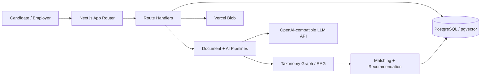

# PairJob

PairJob là nền tảng kết nối việc làm tự do dùng AI để chuẩn hóa JD/CV, giải thích tỷ lệ phù hợp, đề xuất hai chiều và xây dựng lộ trình phát triển cho ứng viên.

- Production: https://pairjob.vercel.app
- Báo cáo bàn giao PDF: https://github.com/Minwsun/pairjob/releases/latest
- Tác giả: Nguyễn Nhật Minh
- Email: ngynhaatminh@gmail.com
- Điện thoại: 0373973754

## Bài toán

- JD có thể thiếu dữ liệu, sai chính tả, viết tắt hoặc dùng thuật ngữ không thống nhất.
- CV có thể là PDF, DOCX hoặc URL; nội dung dài và thiếu cấu trúc.
- Matching cần nhận ra kỹ năng gần nghĩa, kỹ năng chuyển đổi và quan hệ nghề nghiệp.
- Kết quả cần có điểm, lý do và hướng phát triển cụ thể.

## Tính năng

### Nhà tuyển dụng

- Tạo và chỉnh sửa tin tuyển dụng.
- AI trích xuất nghề, kỹ năng, kinh nghiệm, bằng cấp, ngôn ngữ và điều kiện làm việc.
- Popup hỏi lại các thông tin quan trọng còn thiếu.
- Chuẩn hóa yêu cầu vào taxonomy graph.
- Xem, xếp hạng và giải thích ứng viên phù hợp.
- Quản lý ứng tuyển và trạng thái xử lý.

### Ứng viên

- Nhập CV PDF có text layer, DOCX hoặc URL portfolio công khai.
- AI tạo hồ sơ có cấu trúc và hỏi thêm khi CV thiếu dữ liệu.
- Chỉnh sửa hồ sơ đã nhập.
- Xem việc làm phù hợp cùng điểm và lý do matching.
- Ứng tuyển và theo dõi trạng thái.
- Nhận lộ trình phát triển bám theo nghề hiện tại, kỹ năng thiếu và nhu cầu tuyển dụng.

## Kiến trúc



Pipeline chính:

```text
Raw JD/CV -> Parse -> AI extraction -> Schema validation -> Clarification
-> Taxonomy normalization -> Canonical profile -> Retrieval -> Matching
-> Explanation -> Recommendation -> Career roadmap
```

Chi tiết: [docs/ARCHITECTURE.md](docs/ARCHITECTURE.md)

## RAG Và Matching

PairJob không để LLM tự chấm toàn bộ dữ liệu. Hệ thống truy xuất ứng viên/job bằng dữ liệu canonical, full-text, vector và taxonomy graph trước. Matching engine sau đó chấm nghề, kỹ năng, kinh nghiệm, điều kiện làm việc và bằng cấp. AI chỉ bổ sung semantic review, giải thích và lộ trình trên tập kết quả đã thu hẹp.

Ba trạng thái hiển thị:

- Phù hợp: quan hệ nghề/kỹ năng đủ mạnh.
- Phù hợp nhưng còn thiếu: có nền tảng liên quan nhưng thiếu một số yêu cầu quan trọng.
- Chưa phù hợp: khác nhóm nghề hoặc thiếu các điều kiện cốt lõi.

## Công nghệ

- Next.js 16, React 19, TypeScript.
- PostgreSQL, Prisma ORM, pgvector.
- Zod structured validation.
- `pdf-parse`, Mammoth, Cheerio.
- Vercel, Vercel Blob, Neon.
- Reasoning model: `cx/gpt-5.6-terra`.
- Fast model: `cx/gpt-5.4-mini`.

Danh sách đầy đủ: [docs/TECH_STACK.md](docs/TECH_STACK.md)

## Chạy Local

### Yêu cầu

- Node.js 20 trở lên.
- PostgreSQL hỗ trợ extension `vector`.
- Một API LLM tương thích OpenAI Chat Completions.

### Cài đặt

```powershell
git clone -b submission https://github.com/Minwsun/pairjob.git
cd pairjob
npm install
Copy-Item .env.example .env
```

Cập nhật `.env`, sau đó chạy:

```powershell
npm run db:up
npm run db:deploy
npm run db:seed-taxonomy
npm run db:seed-education
npm run dev
```

Mở `http://localhost:3000`.

### Biến môi trường

| Biến | Bắt buộc | Mục đích |
|---|---:|---|
| `DATABASE_URL` | Có | PostgreSQL/Neon connection string |
| `LLM_BASE_URL` | Có | Endpoint `/v1` tương thích OpenAI |
| `LLM_API_KEY` | Có | Khóa gọi model |
| `LLM_REASONING_MODEL` | Có | Model extraction/reasoning |
| `LLM_FAST_MODEL` | Có | Model tác vụ ngắn |
| `BLOB_READ_WRITE_TOKEN` | Production | Lưu tài liệu trên Vercel Blob |
| `CRON_SECRET` | Production | Bảo vệ endpoint recompute nội bộ |

Không commit `.env`, token hoặc database URL thật.

## Build Production

```powershell
npm run db:deploy
npm run build
npm run start
```

Vercel dùng `npm run vercel-build`. Cấu hình secret trong Project Settings, không đặt trong source.

## Hướng Dẫn Sử Dụng

Xem [docs/USER_GUIDE.md](docs/USER_GUIDE.md).

## Dữ Liệu

Nhánh bàn giao không chứa CV giả, job giả, dữ liệu ứng viên, log hoặc benchmark. Taxonomy nền được tạo bằng script vận hành; người đánh giá có thể tạo JD và nhập CV trực tiếp trên production.

## Giới Hạn

- PDF scan không có text layer được đánh dấu `OCR_REQUIRED`; bản bàn giao không phân phối OCR AGPL.
- Chất lượng semantic phụ thuộc model/provider được cấu hình.
- Background task hiện dùng cơ chế của Next.js/Vercel, chưa có distributed queue riêng.
- Hệ thống demo sử dụng tài khoản vai trò cố định, chưa triển khai authentication đa tenant hoàn chỉnh.

## License

Mã PairJob phát hành theo ISC License. Thư viện và dữ liệu bên thứ ba giữ nguyên license tương ứng; xem [THIRD_PARTY_NOTICES.md](THIRD_PARTY_NOTICES.md).
