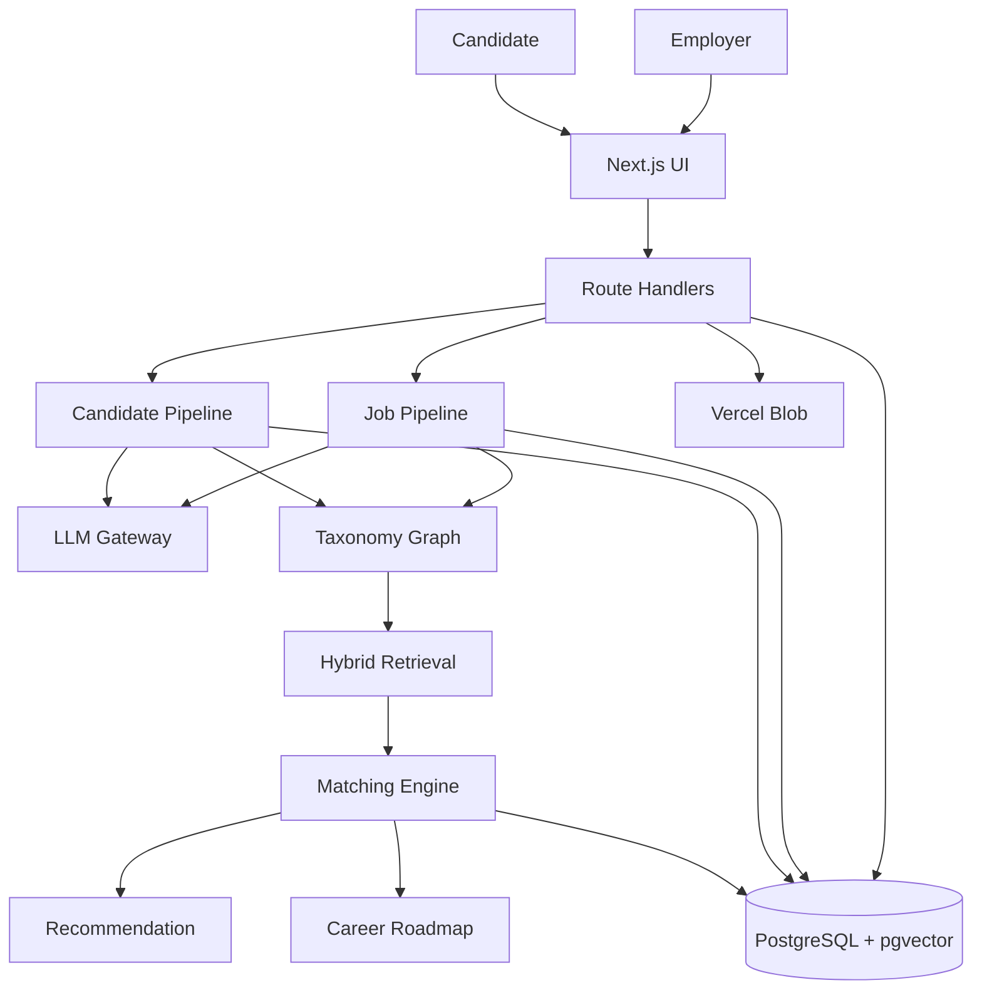
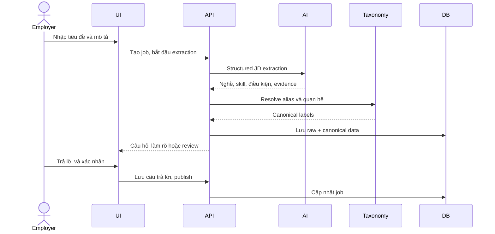
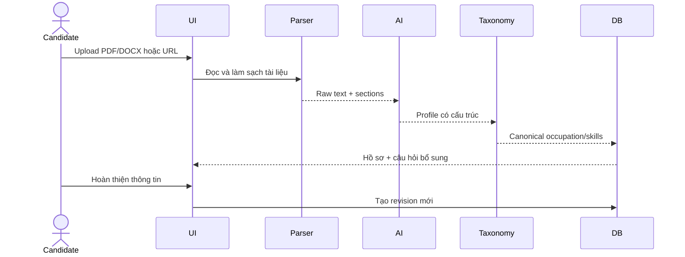
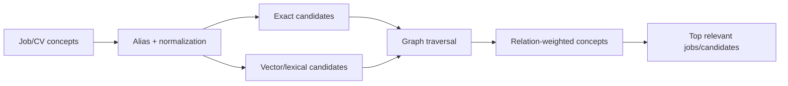
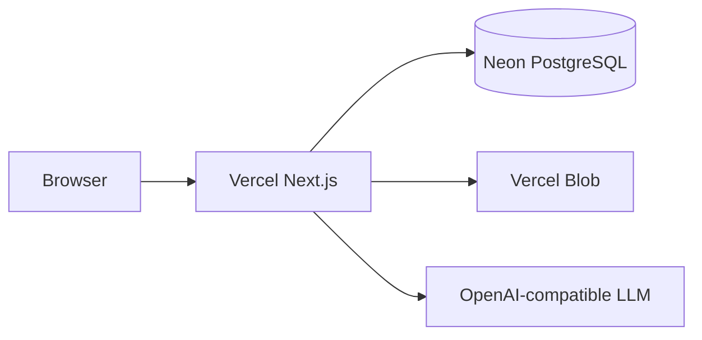

# Kiến Trúc Hệ Thống PairJob

## 1. Mục tiêu thiết kế

PairJob giải quyết bốn vấn đề: hiểu JD tự nhiên, đọc CV đa định dạng, matching có thể giải thích và tạo lộ trình phát triển. Kiến trúc tách AI reasoning khỏi luật nghiệp vụ: AI hiểu ngôn ngữ; code xác thực schema, quản trị taxonomy, truy xuất và chấm điểm.

## 2. Sơ đồ tổng thể

## 3. Thành phần

| Thành phần | Trách nhiệm |
|---|---|
| Next.js UI | Giao diện hai vai trò, loading/progress, form và kết quả |
| Route Handlers | Validation, workflow, quyền truy cập demo, response JSON |
| Document Parser | PDF text, DOCX, HTML/URL, section extraction |
| AI Harness | Model routing, timeout, retry, structured output |
| Clarification Planner | Chọn câu hỏi có giá trị thông tin cao |
| Taxonomy Resolver | Alias, sửa chính tả, label, cây nghề/kỹ năng, semantic edge |
| Hybrid Retrieval | Full-text, vector, graph, deduplication |
| Matching Engine | Điểm đa tiêu chí, trạng thái và breakdown |
| Recommendation Engine | Xếp hạng job/ứng viên hai chiều |
| Roadmap Engine | Phân tích khoảng thiếu và kế hoạch phát triển |
| PostgreSQL/Prisma | Canonical data, lịch sử, matching, pipeline audit |

## 4. Pipeline JD

Raw JD luôn được giữ lại. AI không ghi đè dữ liệu gốc; kết quả chuẩn hóa nằm ở các field canonical và label mappings.

## 5. Pipeline CV

Parser giới hạn dung lượng, kiểm tra URL tránh SSRF và tách section. PDF không có text layer được đánh dấu cần OCR thay vì suy đoán dữ liệu sai.

## 6. Taxonomy Graph Và RAG

Graph chứa quan hệ rộng-hẹp, gần nghĩa, yêu cầu, công nghệ sử dụng và khả năng chuyển đổi. Ví dụ Information Technology có thể liên hệ Web, Backend, Frontend, Security, Data và Infrastructure nhưng không mặc định đồng nhất với Accounting.

RAG được dùng để lấy ngữ cảnh liên quan trước khi AI giải thích hoặc viết roadmap. LLM không quét toàn bộ database.

## 7. Matching

Matching kết hợp:

- Mức phù hợp nghề/ngành.
- Kỹ năng bắt buộc và ưu tiên.
- Quan hệ semantic trong graph.
- Kinh nghiệm.
- Work mode, địa điểm, thời gian.
- Bằng cấp, ngôn ngữ, chứng chỉ khi có yêu cầu.
- Evidence và confidence.

Kết quả lưu tổng điểm, breakdown, điểm thiếu và lý do. Màu chỉ là cách trình bày của score, không phải luật loại ứng viên tuyệt đối.

## 8. Recommendation Và Roadmap

Recommendation xếp hạng top kết quả sau retrieval, loại trùng và áp dụng feedback. Roadmap nhận hồ sơ canonical, nghề mục tiêu, graph lân cận và khoảng thiếu từ các job liên quan để viết: vị trí hiện tại, điểm mạnh, kỹ năng cần bổ sung, việc cần làm và mốc phát triển.

## 9. Cache Và Tác Vụ Nền

- Profile revision giúp chỉ tính lại khi CV thay đổi.
- Embedding và search document được lưu trong DB.
- Matching gắn với phiên bản profile, taxonomy và ranking policy.
- Recompute task xử lý phần nặng ngoài request chính.
- Pipeline run cung cấp trạng thái từng stage cho UI.

## 10. Dữ liệu chính

- `User`, `CandidateProfile`, `ProfileRevision`.
- `Document`, `Job`, `Application`.
- `TaxonomyLabel`, `TaxonomyAlias`, `TaxonomyEdge`, `TaxonomyResolution`.
- `JobLabelMapping`, `CandidateConceptAssertion`.
- `MatchResult`, `RecommendationSession`, `RecommendationItem`.
- `PipelineRun`, `PipelineEvent`, `RecomputeTask`, `RoadmapVersion`.

## 11. Deployment

Production: https://pairjob.vercel.app

## 12. Giới hạn

- Authentication hiện là chế độ demo, chưa phải hệ thống đa tenant hoàn chỉnh.
- Không phân phối OCR AGPL; PDF scan cần giải pháp OCR do đơn vị triển khai lựa chọn.
- Tác vụ nền chưa dùng queue độc lập có dead-letter queue.
- Taxonomy cần tiếp tục được giám sát khi số lượng label tăng.
